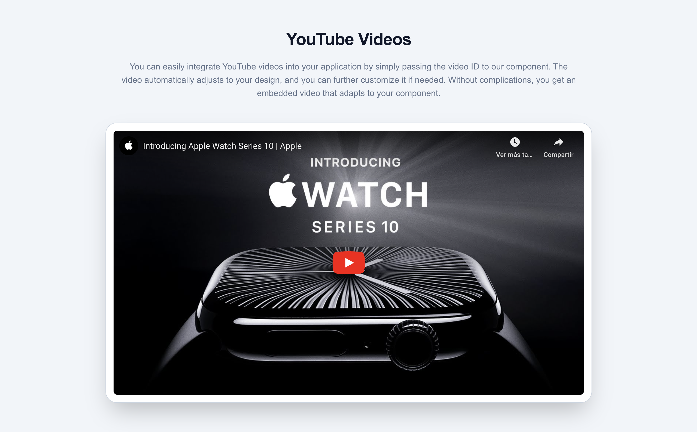
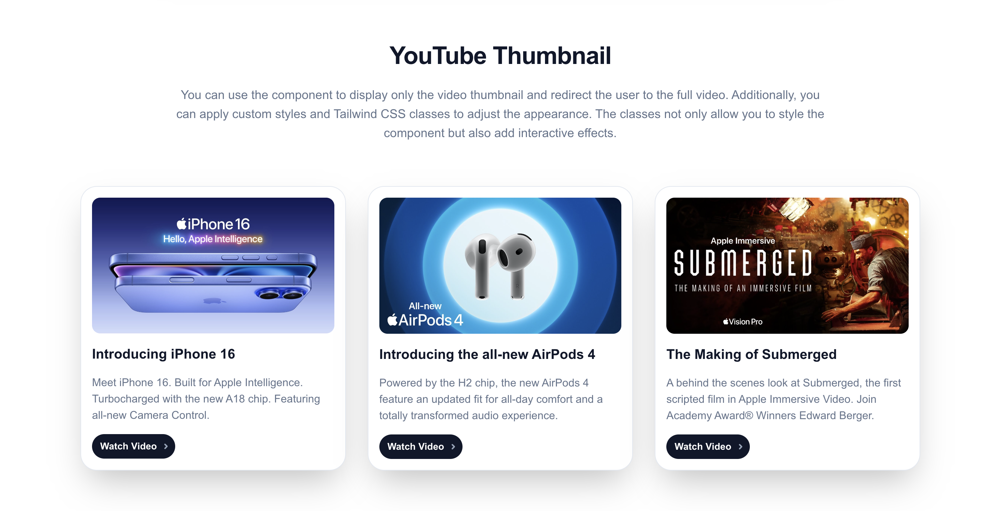

<p align="center">
  
</p>

<h1 align="center">React YouTube Flexible</h1>

<!--
<p align="center">
  <a href="https://www.npmjs.com/package/react-yt-flexible">
    
  </a>
  <a href="https://github.com/luiserj/react-yt-flexible/blob/main/LICENSE">
    
  </a>
  <a href="https://www.npmjs.com/package/react-yt-flexible">
    
  </a>
  <a href="https://github.com/luiserj/react-yt-flexible/commits/main">
    
  </a>
</p>
-->

A highly flexible React component for embedding YouTube videos or thumbnails, with customizable aspect ratios, styles, and seamless integration with Tailwind CSS.

## Example Gallery

Check out these examples to see what you can achieve with `ReactYTFlexible`:


*Standard video with custom border radius*


*Thumbnail with hover effect and custom styling*

## Live Demo

Check out our [live demo](https://codesandbox.io/p/github/luiserj/react-yt-flexible-examples/main?import=true) to see `ReactYTFlexible` in action and explore more usage examples.

## Key Features

- Embed YouTube videos or thumbnails with a single video ID.
- Customizable aspect ratios (16:9, 4:3, 21:9, 1:1, 9:16, 3:2).
- Support for custom styles and Tailwind CSS classes.
- Lightweight and easy to use.
- Perfect for responsive designs and easily adaptable to various screen sizes.
- Seamless integration with Tailwind CSS for rapid UI development.

## Installation

Install the package using npm:

```bash
npm install react-yt-flexible
```

## Usage

To use the `ReactYTFlexible` component, simply import it and pass the `videoId` of the YouTube video you want to embed:

```jsx
import React from 'react';
import { ReactYTFlexible } from 'react-yt-flexible';

function App() {
  return (
    <div>
      {/* Standard video */}
      <ReactYTFlexible videoId="dQw4w9WgXcQ" />
      
      {/* Thumbnail mode with custom border radius */}
      <ReactYTFlexible
        videoId="dQw4w9WgXcQ"
        mode="thumbnail"
        borderRadius="1rem"
      />
    </div>
  );
}

export default App;
```

## Props

Here are the available props for the `ReactYTFlexible` component:

- **`videoId`** (string, required): The YouTube video ID.
- **`mode`** (string, optional): Either `'video'` or `'thumbnail'`. Default is `'video'`.
- **`aspectRatio`** (string, optional): `'16:9'`, `'4:3'`, `'21:9'`, `'1:1'`, `'9:16'`, or `'3:2'`. Default is `'16:9'`.
- **`borderRadius`** (string, optional): CSS border-radius value. Default is `'0px'`.
- **`style`** (object, optional): Custom inline styles.
- **`className`** (string, optional): Tailwind CSS or other class names for additional styling.

## Tailwind CSS Integration

`ReactYTFlexible` is designed to work seamlessly with Tailwind CSS, allowing you to:

- Apply Tailwind utility classes directly to the component
- Create responsive designs effortlessly
- Implement hover, focus, and other interactive states
- Utilize Tailwind's animation and transition utilities

Example:

```jsx
<ReactYTFlexible
  videoId="dQw4w9WgXcQ"
  mode="thumbnail"
  className="rounded-lg shadow-lg transition duration-500 group-hover:scale-105"
/>
```

This integration allows you to rapidly prototype and build beautiful, responsive YouTube embeds without leaving your Tailwind workflow.

## License

This project is licensed under the MIT License. You can find the full license [here](https://github.com/luiserj/react-yt-flexible/blob/main/LICENSE).